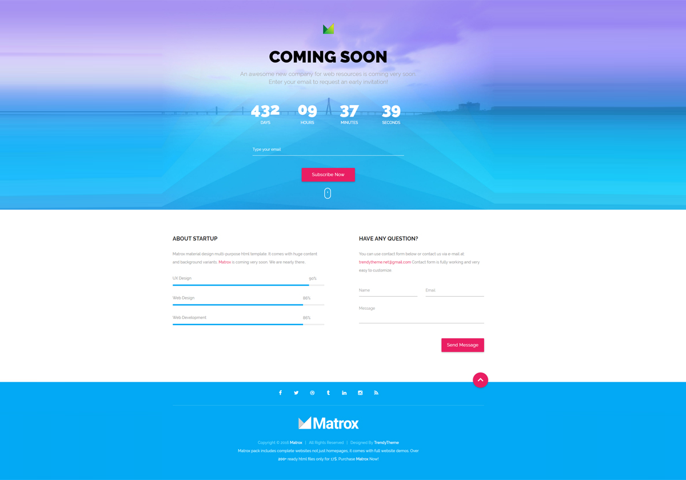

[](https://discord.gg/dRwW4rw)

# 10-coming-soon
_Website design project_
<br>

<br>
## 🌟 About

This project is for educational porpuses only, HTML5 and CSS testing. Pull request are welcome, but priority for project authors! Thank you for your cooperation!

Site published at: https://audrbar.github.io/10-coming-soon/

Design: [COMIG SOON](./images/coming-soon-wide.png)

## 🎯 Project features/goals

-   Github pages
-   Responsive design
-   CSS animation
-   basic [HTML (structure)](https://www.w3schools.com/TAGS/default.asp) and CSS (style)
-   [markdown](https://docs.github.com/en/get-started/writing-on-github/getting-started-with-writing-and-formatting-on-github/basic-writing-and-formatting-syntax)

## 🧰 Getting Started

### 💻 Prerequisites

Node.js - _download and install_

```
https://nodejs.org
```

Git - _download and install_

```
https://git-scm.com
```

### 🏃 Run locally

Would like to run this project locally? Open terminal and follow these steps:

1. Clone the repo
    ```sh
    git clone https://github.com/audrbar/10-coming-soon.git
    ```
2. Install NPM packages
    ```sh
    npm i
    ```
    or
    ```sh
    npm install
    ```
3. Run the server
    ```sh
    npm run dev
    ```

### 🧪 Running tests

There is no tests for this project.

## 🎅 Authors

Audrius: [Github](https://github.com/audrbar)

## ⚠️ License

Distributed under the MIT License. See LICENSE.txt for more information.

## 🔗 Other resources

No other resouces.
